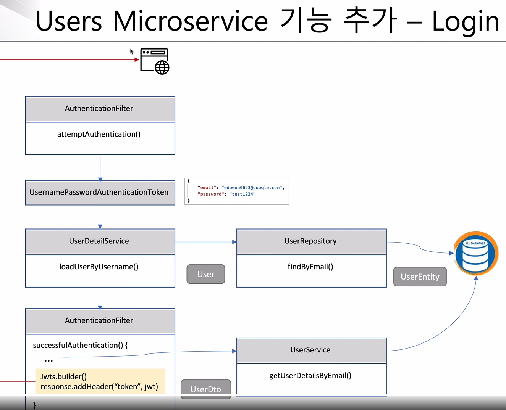

# LoginWorkFlow




1. email name password 정보가 1차적으로 들어옴. __AuthenticationFilter__
        (** Filter 는 유일하게 request 에대한 parameter 변조가 가능하며 한번 읽어들인 request 에 대한 값은 다시 읽어 들일수 없음.)
        (** ContentCachingRequestWrapper 객체를 활용해보자.)

```java
@Override
    public Authentication attemptAuthentication(HttpServletRequest request,
                                                HttpServletResponse response) throws AuthenticationException {
        /* ContentCachingRequestWrapper cacheRequest = new ContentCachingRequestWrapper(request);  */                                            

        try {
            // POST 방식으로 넘긴 JSON 을 request 형태로 받으려면 getInputStream 으로 받아야함.  1. 로그인 정보가 가장먼저 적재 되는곳.
            RequestLogin creds = new ObjectMapper().readValue(
                                                              request.getInputStream(), 
                                                              RequestLogin.class
                                                        );

            //이렇게 인증으로 넘기면 Spring security 에서 아이디와 비밀번호를 비교 해주겠다는 의미.
            return getAuthenticationManager()
                    .authenticate(
                            new UsernamePasswordAuthenticationToken( /* email 과 password 를 바탕으로 Token 을 생성함 */
                                    creds.getEmail()       /* 위 객체에서 생성된 Token 값을 AuthenticationManager 에게 위함함*/
                                    , creds.getPassword()
                                    , new ArrayList<>()
                            )
                    );
        }
```

2. AuthenticationManager 객체는 생성된 Token 을 바탕으로 UserService 에 등록 되어있는 UserDetails 객체에서 request 에 입력된 email or id 를 바탕으로 사용자를 검색 **User -> Springsecurity 제공객체 
```java

public class UserServiceimpl implements UserService{

    @Override
    public UserDetails loadUserByUsername(String email) throws UsernameNotFoundException {

        UserEntity userEntity = userRepository.getUser(email);

        if(userEntity == null){
            throw new UsernameNotFoundException(email);
        }
        return new User(
                userEntity.getUserId()
                , userEntity.getEncryptedPwd()
                , true
                , true
                , true
                , true
                , new ArrayList<>()
        ); // SpringSecurity 에서 제공하는 객체로 비밀번호 의 유효성까지 체크가 완료 되었을시 User객체 반환
    }
}


```

